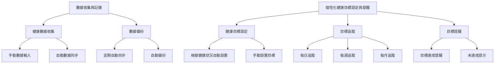

# 功能性需求

1. 數據收集與記錄
 * 支援多種健康數據的收集，ex:心率、步數、睡眠狀況
 * 提供手動和自動的數據輸入選項
 * 定期自動同步和備份數據
2. 個性化健康目標設定與提醒
 * 根據使用者的健康狀況和目標，個性化健康目標設置
 * 提供每日、每週、每月的健康目標追蹤
 * 健康目標達成情況提醒與提示

3. 數據分析與健康風險評估
 * 對收集的健康數據進行自動分析並生成報告
 * 健康風險評估與提示
 * 提供健康建議和行動計劃

# 非功能性需求
1. 系統性能
 * 支持高並發的數據處理能力，能同時處理多個使用者的數據
 * 迅速響應使用者操作，提供流暢的使用體驗
2. 資料安全
* 保護使用者的數據隱私，數據傳輸和存儲加密
* 定期進行安全性檢查和漏洞修補
3. 使用者體驗
* 提供直觀和友好的使用者界面
* 支持多種語言和文化背景的使用者
* 提供詳細的幫助文檔和使用教程

# 功能分解圖 (FDD)

# 使用案例圖

