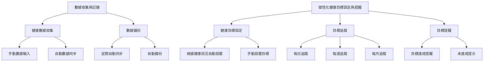
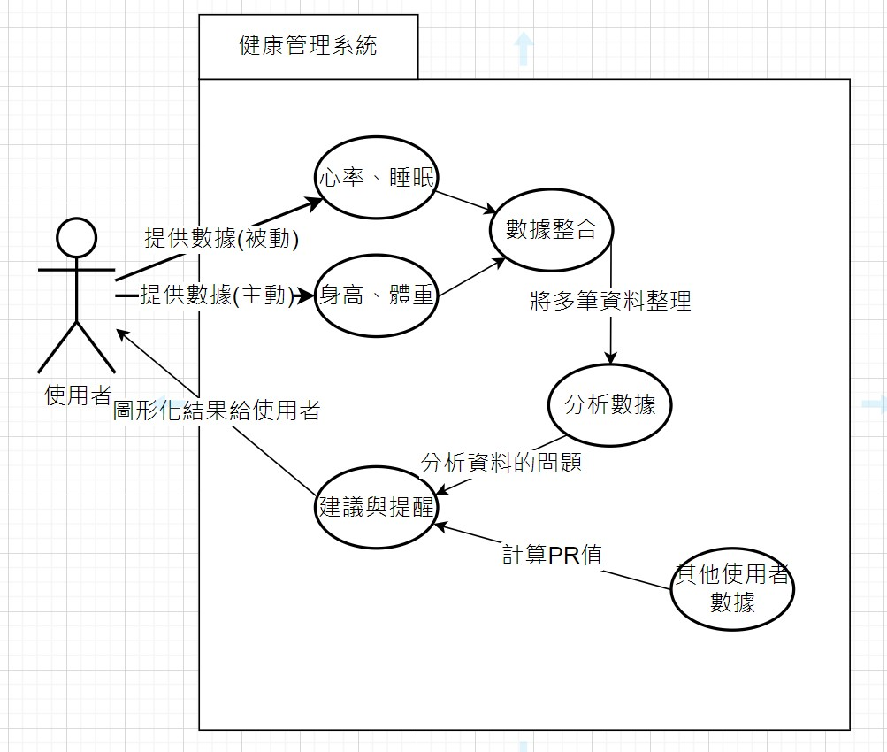

# 功能性需求

1. 數據收集與記錄
 * 支援多種健康數據的收集，ex:心率、步數、睡眠狀況
 * 提供手動和自動的數據輸入選項
 * 定期自動同步和備份數據
2. 個性化健康目標設定與提醒
 * 根據使用者的健康狀況和目標，個性化健康目標設置
 * 提供每日、每週、每月的健康目標追蹤
 * 健康目標達成情況提醒與提示

3. 數據分析與健康風險評估
 * 對收集的健康數據進行自動分析並生成報告
 * 健康風險評估與提示
 * 提供健康建議和行動計劃

# 非功能性需求
1. 系統性能
 * 支持高並發的數據處理能力，能同時處理多個使用者的數據
 * 迅速響應使用者操作，提供流暢的使用體驗
2. 資料安全
* 保護使用者的數據隱私，數據傳輸和存儲加密
* 定期進行安全性檢查和漏洞修補
3. 使用者體驗
* 提供直觀和友好的使用者界面
* 支持多種語言和文化背景的使用者
* 提供詳細的幫助文檔和使用教程

# 功能分解圖 (FDD)

# 使用案例圖

# 使用案例1：數據收集與記錄 

流程：

      1. 設備自動追蹤使用者的生理指標，如步數、心率、睡眠狀況等。
      2. 將數據通過手動和自動的方式同步到健康管理系統。
      3. 系統接收到數據後，並將數據存儲到使用者的健康檔案中。

例外情況：如果設備發送的數據格式與系統不兼容，系統應提示數據讀取失敗，並將錯誤記錄在後台。

# 使用案例2：個性化健康目標設定與提醒

流程：

      1. 使用者進入目標設定界面，設置想要的目標類型和提醒運動的時間，並儲存設定。
      2. 根據使用者的目標與提醒，系統會在指定的時間通知使用者。
      3. 使用者可以在系統看每日、每週、每月的健康目標追蹤，系統會提供相關數據以評估達成目標的情況。
      
例外情況：如果使用者設定的提醒時間不合理（如過去的時間），系統會提示用戶修改為有效的時間。

# 使用案例3：數據分析與健康風險評估 

流程：

      1. 使用者在系統中選擇「數據分析」或「健康風險評估」的選項。
      2. 如果選擇「數據分析」，系統從使用者的健康檔案中提取數據，進行自動分析並生成報告。
      3. 如果選擇「健康風險評估」，系統將分析結果，評估用戶的健康風險。
      4. 系統根據風險評估結果，提供個性化的健康改善建議。

例外情況：如果系統中缺少足夠的健康數據進行分析，系統會提示用戶數據不足，並建議用戶進行更多的數據收集。
