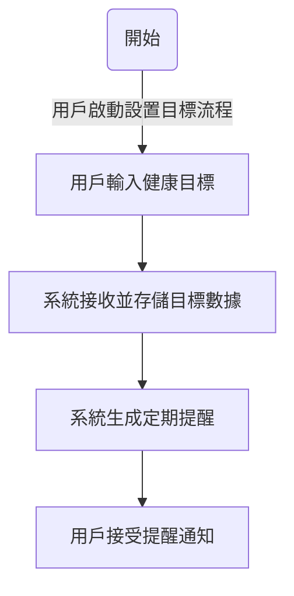

# UML類別圖
# 使用案例一：設置健康目標
## 循序圖

## 活動圖

```mermaid
graph TD
    A(開始) -->|用戶啟動設置目標流程| B[用戶輸入健康目標]
    B --> C[系統接收並存儲目標數據]
    C --> D[系統生成定期提醒]
    D --> E[用戶接受提醒通知]
```
# 使用案例二：生成健康報告
## 循序圖
## 活動圖
